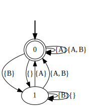
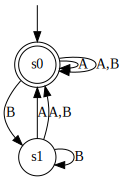

# learnlib-examples
Learning regular languages using LearnLib.

## Dependencies

- [Graphviz](https://www.graphviz.org/download/)
- To install the Python packages for the script `generate_traces.py` 

      pip install -r requirements.txt

## Generate traces

`generate_traces.py` is a Python script that given an LTLf formula generates
a list of traces labelled with the satisfaction wrt the provided formula.


E.g. to generate traces for 'eventually A':

   python generate_traces.py "F A" eventually --fluents A B --max-length 4 --dirpath data

The output will be in the directory `data/`, and you'll get:

- `data/eventually.txt` that contains all the generated traces. The format of the file is one line per trace.
  A generic lines contains, in this order: 
  - the first character `Y` if the trace is accepted by the LTL formula or `N` otherwise, 
  - a `\t`
  - the sequence of symbols separated by `;`, where each symbol contains fluents separated by `,`. 
  Example:
```
Y\tFluent1,Fluent2,Fluent3;Fluent2;Fluent3
N\tFluent1;Fluent2
```

## Learn from traces

- Install [Maven](https://maven.apache.org/)
- Compile

      mvn compile

- Run:

      mvn exec:java  -Dexec.mainClass=com.sapienza.App -Dexec data/eventually

  alternatively:

      ./learnrb ./data/eventually

The DOT file of the DFA learned will be stored in `data/eventually`.

## Demo

- `python generate_traces.py "G F A" always-eventually --fluents A B --max-length 6 --dirpath data` 

We get the automaton `./data/always-eventually.svg`:



and the traces in `./data/always-eventually`
```
Y	
Y	A,B
Y	A
N	B
Y	A,B;A,B
Y	A,B;A
N	A,B;B
Y	A;A,B
Y	A;A
...
```

- `mvn compile`
- `./learnrb data/always-eventually`

We get `./data/always-eventually.txt.learned.svg`:


